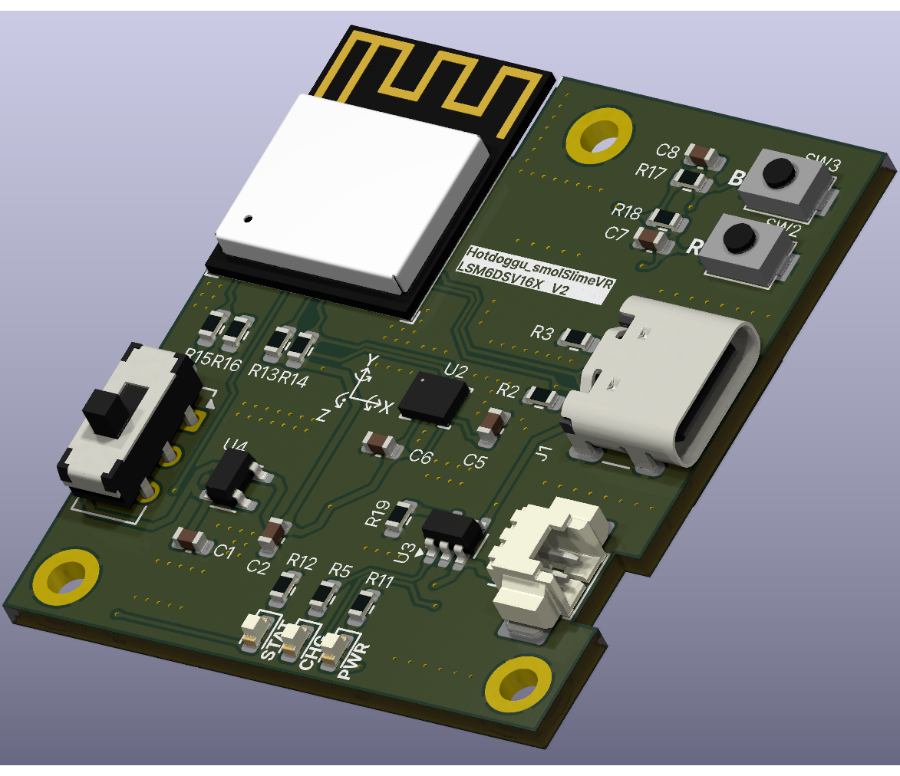
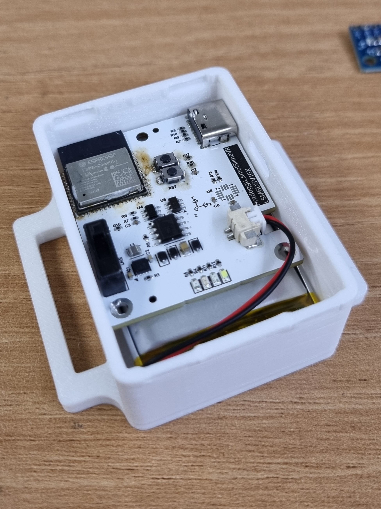

 
# hotdoggu_smolSlimeVR
KiCad project - slimevr tracker using  ESP32-C3-MINI-1, LSM6DSV16X    
Includes 3d-printable case **(for 34\*50\*10(H) Li-Polymer battery)**
# Used Components
### BOM for hotdoggu_smolSlimeVR

| Comment | Designator | Footprint | LCSC | Quantity |
|---------|------------|-----------|------|----------|
| 10k | R13,R14,R17,R18 | R_0603_1608Metric | C15401 | 4 |
| TYPE-C-31-M-12 | J1 | USB_C_Receptacle_GCT_USB4105-xx-A_16P_TopMnt_Horizontal | C165948 | 1 |
| 1k | R11,R12,R15,R16 | R_0603_1608Metric | C21190 | 4 |
| JS202011CQN | SW1 | SW_CK_JS202011CQN_DPDT_Straight | C221663 | 1 |
| 53261-0271 | J2 | Molex_PicoBlade_53261-0271_1x02-1MP_P1.25mm_Horizontal | C225111 | 1 |
| LED,0603,Red | LED1 | LED_0603_1608Metric | C2286 | 1 |
| 0603,White | LED3 | LED_0603_1608Metric | C2290 | 1 |
| 5.1k, 1% | R2,R3,R5 | R_0603_1608Metric | C23186 | 3 |
| ESP32-C3-MINI-1-H4 | U1 | ESP32-C3-MINI-1 | C2934569 | 1 |
| 2k | R19 | R_0603_1608Metric | C4190 | 1 |
| MCP73831-2-OT | U3 | SOT-23-5 | C424093 | 1 |
| LSM6DSV16X | U2 | LGA-14_3x2.5mm_P0.5mm_LayoutBorder3x4y | C5267406 | 1 |
| 100nF | C5,C6,C7,C8 | C_0603_1608Metric | C66501 | 4 |
| 0603,Yellow | LED2 | LED_0603_1608Metric | C72038 | 1 |
| TS-1088-AR02016 | SW2,SW3 | TS-1088-AR02016 | C720477 | 2 |
| LP5907MFX-3.3 | U4 | SOT-23-5 | C80670 | 1 |
| 10uF | C1,C2 | C_0603_1608Metric | C96446 | 2 |    
### Battery
|Component|Description|Link|
|---------|-----------|----|
|DTP103450|3.7V 1800mAh Li-Polymer battery 34\*50\*10(H)| https://www.devicemart.co.kr/goods/view?no=15285794|
# slimeVR Configuration
**platformio.ini**
```ini
[env:esp32c3]
platform = espressif32 @ 6.7.0
platform_packages =
 framework-arduinoespressif32 @ https://github.com/espressif/arduino-esp32.git#3.0.1
 framework-arduinoespressif32-libs @ https://github.com/espressif/arduino-esp32/releases/download/3.0.1/esp32-arduino-libs-3.0.1.zip
build_flags =
 ${env.build_flags}
 -DESP32C3
board = lolin_c3_mini
```
    
**defines.h**
```C
#define IMU IMU_LSM6DSV
#define SECOND_IMU IMU
#define BOARD BOARD_CUSTOM
#define IMU_ROTATION DEG_0
#define SECOND_IMU_ROTATION DEG_0
#define PRIMARY_IMU_OPTIONAL false
#define SECONDARY_IMU_OPTIONAL true
#define MAX_IMU_COUNT 1
#ifndef IMU_DESC_LIST
#define IMU_DESC_LIST \
    IMU_DESC_ENTRY(IMU,        PRIMARY_IMU_ADDRESS_TWO,   IMU_ROTATION,        PIN_IMU_SCL, PIN_IMU_SDA, PRIMARY_IMU_OPTIONAL, PIN_IMU_INT)
#endif
#define BATTERY_MONITOR BAT_EXTERNAL
#elif BOARD == BOARD_CUSTOM
#define LED_PIN 10
#define LED_INVERTED false
#define PIN_IMU_SDA 3
#define PIN_IMU_SCL 4
#define PIN_IMU_INT 255
#define PIN_IMU_INT_2 255
#define PIN_BATTERY_LEVEL 0
#define BATTERY_SHIELD_RESISTANCE 0
#define BATTERY_SHIELD_R1 1000
#define BATTERY_SHIELD_R2 1000
```
